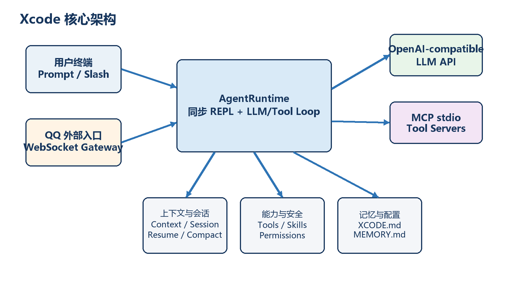
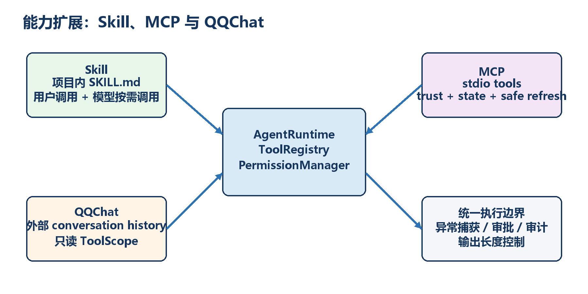
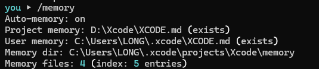
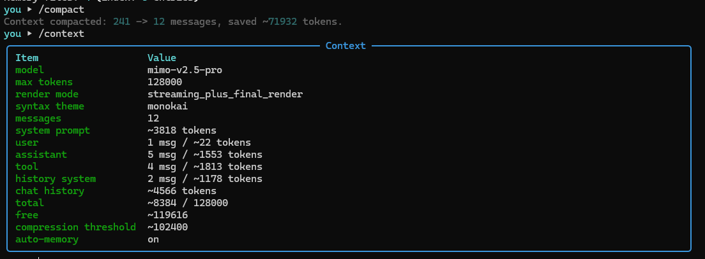
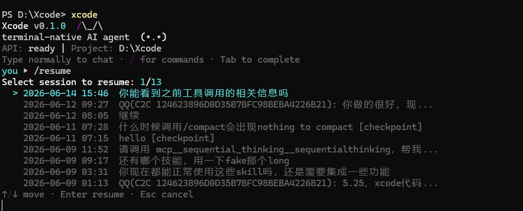
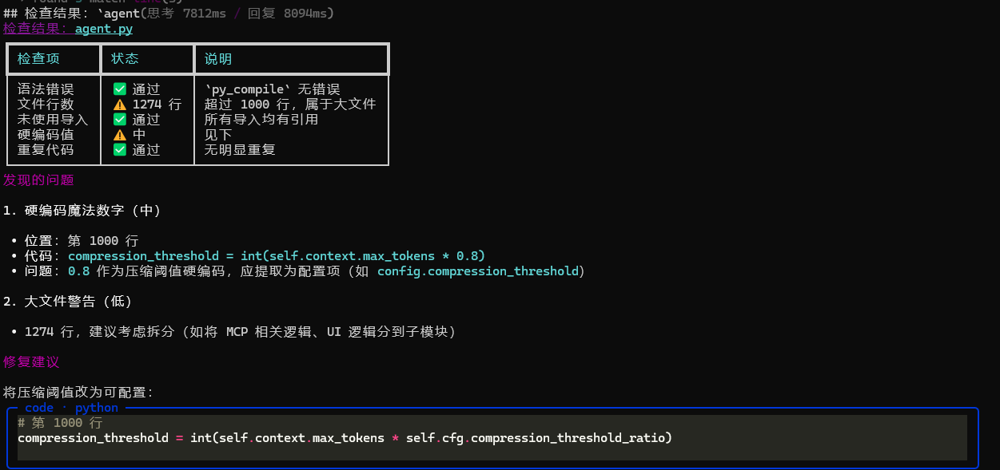
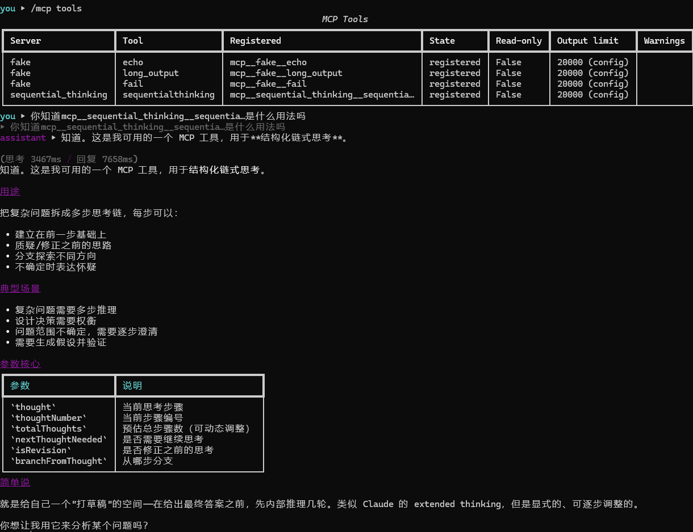
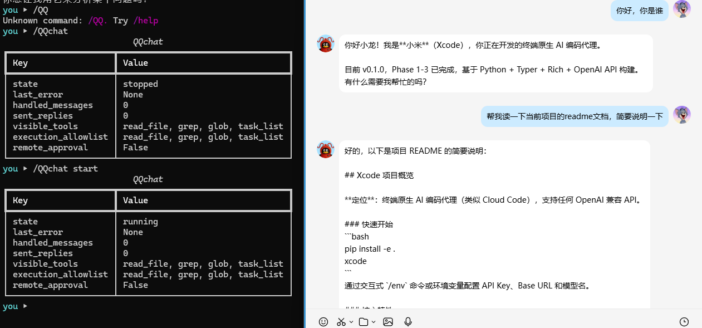

# Xcode

简体中文 | [English](README.en.md)

> 一个面向本地开发工作的终端原生 AI 编码 Agent。它把模型推理、工具执行、权限审批、会话恢复和持久记忆组织成一条可观察、可控制、可扩展的工程工作流。

## 项目简介

Xcode 不是给聊天界面再套一层命令行，而是让大模型能够在真实代码仓库中持续工作：理解项目上下文、搜索和编辑文件、运行命令、拆解任务，并在执行有副作用的操作前交由用户确认。

项目通过 OpenAI-compatible API 连接模型，围绕同步 `AgentRuntime` 构建 LLM/tool loop；工具、权限、上下文、会话与记忆均有独立边界。Windows 是当前主要目标平台，核心终端交互会优先在 PowerShell 和 cmd.exe 中验收。



## 核心能力

- **终端原生交互**：基于 Typer、Rich 与 prompt_toolkit，支持流式回答、Markdown 渲染、语法高亮、状态栏和命令补全。
- **真实工具调用**：模型可读取、写入和增量编辑文件，执行搜索与 shell 命令，并通过任务工具和子 Agent 拆分工作。
- **审批优先**：写文件、编辑文件和 shell 等有副作用操作先展示信息再执行；权限支持会话、项目和全局三级规则。
- **上下文与会话恢复**：提供 token 预算、自动压缩、`/compact` checkpoint、append-only transcript，以及 `/resume` 会话恢复。
- **持久记忆**：通过项目级 `XCODE.md`、用户级 `XCODE.md` 和自动记忆主题文件保存规则、偏好与跨会话知识。
- **计划与任务管理**：支持 Plan Mode、任务追踪和受限子 Agent，把复杂目标拆成可检查的执行步骤。
- **可扩展能力**：项目 Skill 可由用户或模型按需调用；MCP 已支持受信任的 stdio tool server、工具刷新与本机启停管理。
- **外部入口**：提供可选 QQChat 网关，并用独立会话、只读 ToolScope 和远程禁审批约束不可信输入。

## 快速开始

要求 Python 3.10 或更高版本。在仓库根目录安装并启动：

```bash
pip install -e .
xcode
```

首次使用时，可以在 Xcode 内配置任意 OpenAI-compatible 服务：

```text
/env set <your-api-key>
/env base-url <provider-base-url>
/env model <model-name>
```

也可以使用环境变量：

```bash
export XCODE_API_KEY=<key>
export XCODE_BASE_URL=<url>
export XCODE_MODEL=<model>
```

PowerShell 示例：

```powershell
$env:XCODE_API_KEY = "<key>"
$env:XCODE_BASE_URL = "<url>"
$env:XCODE_MODEL = "<model>"
xcode
```

## 常用命令

| 命令 | 作用 |
|------|------|
| `/help` | 查看当前可用命令 |
| `/init` | 分析仓库并创建或改进项目级 `XCODE.md` |
| `/env` | 打开模型、上下文和渲染配置面板 |
| `/context` | 查看当前 token 使用量与上下文预算 |
| `/compact` | 压缩当前对话并写入恢复 checkpoint |
| `/resume` | 浏览并恢复当前项目的历史会话 |
| `/memory` | 查看记忆路径与自动记忆状态 |
| `/plan` | 进入、查看、批准或拒绝计划模式 |
| `/skill` | 列出、查看或校验项目 Skill |
| `/mcp` | 管理受信任的 MCP stdio server 与工具 |
| `/QQchat` | 启动、停止或查看 QQChat 网关状态 |

## 扩展与安全边界

Skill、MCP 和 QQChat 最终都复用同一套工具注册、权限检查、异常捕获与审计链路，但入口拥有不同的能力范围。



- **Skill**：从 `.xcode/skills/<name>/SKILL.md` 加载项目能力，可作为 slash command 使用，也可由模型按需调用。
- **MCP**：当前仅支持本机 stdio tools。配置必须先通过 trust gate；工具默认视为可写，只有显式声明后才按只读工具处理。
- **QQChat**：外部消息使用独立 conversation history，危险工具不会暴露给远程模型，远程用户也不能批准本地副作用操作。
- **异常隔离**：工具失败会转为可读结果返回给 Agent，单个工具异常不应打崩主循环。

## 当前状态

当前版本为 `v0.1.0`。核心 CLI、权限、会话恢复、上下文压缩、Skills 和 MCP stdio tools 已形成可用闭环；auto memory extraction/recall v2 已完成主体实现与自动化回归，仍有部分策略和原生终端验收需要收口。

QQChat 已具备 `start`、`stop`、`status`、WebSocket gateway、消息队列和安全 ToolScope，但真实 QQ 单聊/群聊以及完整原生 Windows 交互仍在验收中。项目不会把这部分描述为已完全完成。

最新状态与未完成项请分别查看 [开发进度](docs/current/PROGRESS.md) 和 [路线图](docs/current/ROADMAP.md)。

## 真实使用截图

以下截图来自项目报告中的实际运行记录，展示 Xcode 在原生终端和 QQChat 中的真实交互效果。

### Memory 与上下文管理

`/memory` 展示项目记忆、用户记忆和自动记忆索引的实际路径与状态：



执行 `/compact` 后，可通过 `/context` 查看压缩结果、各类消息的 token 占用和剩余上下文预算：



### 会话恢复

`/resume` 提供方向键选择菜单，并显示 checkpoint、最近输入和外部会话摘要，便于恢复此前的工作现场：



### Skill 与 MCP

项目 Skill 可以由用户显式调用，也可以由模型按需调用。下图展示 Skill 对代码文件进行检查并输出结构化建议：



MCP 管理面能够展示已发现和注册的工具、只读属性、输出限制与状态，并让模型调用受信任的 stdio tools：



### QQChat

QQChat 网关可在本地查看运行状态和工具边界，并将真实 QQ 单聊消息交给独立的外部会话处理：



## 项目结构

```text
src/xcode_cli/
├── core/          # AgentRuntime、LLM/tool loop、上下文、会话、权限、记忆
├── core/tools/    # 文件、搜索、shell、Skill 与子 Agent 工具
├── mcp/           # MCP stdio 连接、trust、状态、工具适配
├── qqchat/        # QQ 网关、事件、鉴权、消息与服务编排
├── skills/        # 项目 Skill 的加载、校验与 prompt 展开
└── ui/            # Rich 渲染

tests/             # 自动化回归测试
docs/              # 当前文档、规格、计划、说明与历史归档
```

## 文档导航

| 文档 | 内容 |
|------|------|
| [开发进度](docs/current/PROGRESS.md) | 已完成阶段、review 结论和验收证据 |
| [当前架构](docs/current/ARCHITECTURE.md) | 已实现的组件关系、数据流和系统契约 |
| [路线图](docs/current/ROADMAP.md) | 当前 backlog、阻塞、遗留项和下一步 |
| [开发笔记](docs/current/DEVNOTES.md) | 设计取舍、兼容性限制、已知风险和踩坑记录 |
| [MCP 指南](docs/reference/mcp-knowledge-guide.md) | MCP 概念、配置、信任模型与安全边界 |
| [QQChat 配置指南](docs/reference/qqchat-setup-guide.md) | QQChat 的配置和使用说明 |
| [自动记忆召回 v2](docs/explainers/auto-memory-recall-v2.md) | relevant memory recall v2 的设计与边界 |

推荐按“开发进度 → 当前架构 → 路线图 → 开发笔记”的顺序阅读。根目录的 `ARCHITECTURE.md`、`ROADMAP.md`、`PROGRESS.md` 和 `DEVNOTES.md` 仅作为兼容入口。

## 开发与验证

项目采用 **Spec-first + TDD-core + E2E-acceptance**：中等以上行为变更先写规格与计划；核心安全和状态行为以回归测试保护；终端交互、审批菜单、快捷键和 Windows 路径等能力在原生 PowerShell/cmd.exe 中验收。

```bash
pytest -q
```

## 运行要求

- Python >= 3.10
- Windows 为主要目标平台
- Linux/macOS 为部分支持平台；当前 ripgrep bootstrap 主要面向 Windows

## License

MIT

---

Read this document in English: [README.en.md](README.en.md)
