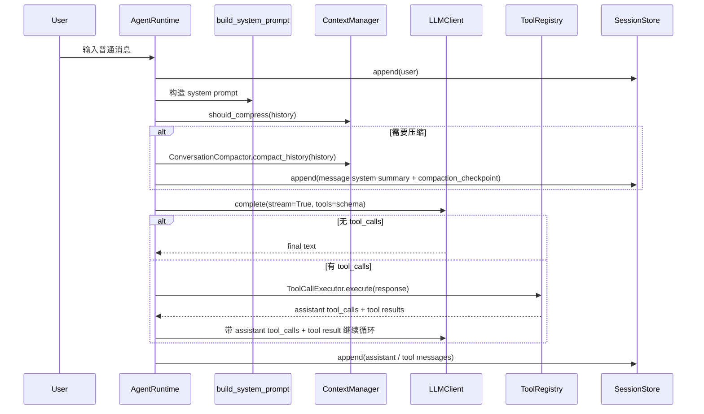
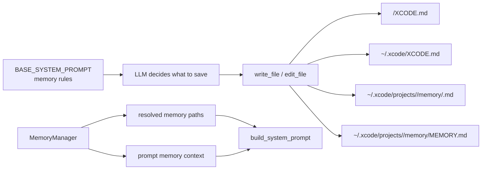

# Xcode 当前架构

> 本文档只描述当前代码已经实现的系统。未来计划和未实现方案放在 `ROADMAP.md`，历史推进过程放在 `PROGRESS.md`，坑和设计取舍放在 `DEVNOTES.md`。

## 1. 系统定位

Xcode 是一个 terminal-native AI coding agent，核心形态是 Python CLI REPL。它通过 OpenAI-compatible API 调用 LLM，并向模型暴露文件、搜索、shell、子 Agent、任务追踪、计划模式和记忆相关工具。

当前版本的主循环是同步实现，不引入 `asyncio`。并发只用于子 Agent，由 `ThreadPoolExecutor` 承担。

## 2. 组件关系图

```mermaid
flowchart TD
    Main["main.py / Typer CLI"] --> Runtime["AgentRuntime<br/>core/agent.py"]
    Main --> Dashboard["Dashboard<br/>core/dashboard.py"]
    Main --> ToolCLI["xcode tool run/grep/glob"]
    Main --> SkillCLI["xcode skill ..."]

    Runtime --> Prompt["PromptSession<br/>prompt_toolkit"]
    Runtime --> Config["ConfigStore<br/>core/config.py"]
    Runtime --> LLM["LLMClient<br/>core/llm.py"]
    Runtime --> Registry["ToolRegistry<br/>core/tool_registry.py"]
    Runtime --> Permissions["PermissionManager<br/>core/permissions.py"]
    Runtime --> Context["ContextManager<br/>core/context.py"]
    Runtime --> Memory["MemoryManager<br/>core/memory.py"]
    Runtime --> Sessions["SessionStore<br/>core/session.py"]
    Runtime --> Resume["SessionResumeBuilder<br/>core/session_resume.py"]
    Runtime --> ResumeSvc["ResumeCommandService<br/>core/conversation/resume.py"]
    Runtime --> Compactor["ConversationCompactor<br/>core/conversation/compaction.py"]
    Runtime --> Approval["ToolApprovalController<br/>core/tooling/approval.py"]
    Runtime --> ToolExec["ToolCallExecutor<br/>core/tooling/execution.py"]
    Runtime --> ShellUI["ShellUI<br/>core/ui/shell.py"]
    Runtime --> Slash["SlashCompleter<br/>core/commands/slash.py"]
    Runtime --> Status["RuntimeStatusStore<br/>core/runtime_status.py"]
    Runtime --> Plan["PlanMode<br/>core/planning.py"]
    Runtime --> Tasks["TaskTracker<br/>core/task_tracker.py"]
    Runtime --> Skills["SkillManager<br/>skills/manager.py"]
    Runtime --> Renderer["OutputRenderer<br/>ui/renderer.py"]

    ResumeSvc --> Resume
    Compactor --> Context
    ToolExec --> Registry
    ToolExec --> Permissions
    ToolExec --> Approval
    ToolExec --> Memory

    Registry --> FileTools["read_file / write_file / edit_file"]
    Registry --> SearchTools["grep / glob"]
    Registry --> ShellTool["run_shell"]
    Registry --> Dispatch["dispatch_agent"]
    Registry --> TaskTools["task_create / task_update / task_list"]
    Registry --> PlanTools["enter_plan_mode / write_plan / exit_plan_mode"]
```



## 3. 入口和主循环

`src/xcode_cli/main.py` 使用 Typer 暴露这些入口：

| 入口 | 当前行为 |
|------|----------|
| `xcode` | 没有子命令时直接启动 `AgentRuntime().run_chat()` |
| `xcode chat` | 启动交互式聊天 |
| `xcode dashboard` | 打开 API 配置 TUI |
| `xcode tool run` | 直接运行 read/write/edit/shell/grep/glob |
| `xcode tool grep` / `xcode tool glob` | PowerShell 友好的搜索子命令 |
| `xcode skill install/list/enable/disable` | 管理本地 skill |

`AgentRuntime.run_chat()` 是 REPL 主循环。它负责创建 UUID session id、写入 runtime status、读取用户输入、处理 slash command、构造 system prompt、调用 `_run_llm_loop()`，并把结构化 message event 追加到当前项目的 JSONL transcript。

经过第一轮模块化重构后，`AgentRuntime` 仍是 orchestration 入口，但不再直接承载所有细节：

- slash completion 已移到 `core/commands/slash.py`。
- 欢迎信息、状态栏、用户/助手基础输出已移到 `core/ui/shell.py`。
- `/resume` 命令编排已移到 `core/conversation/resume.py`。
- `/compact` 和自动 compression checkpoint 编排已移到 `core/conversation/compaction.py`。
- 工具审批菜单已移到 `core/tooling/approval.py`。
- tool call 执行、diff preview、memory auto-allow、工具结果摘要已移到 `core/tooling/execution.py`。
- `/env` 仪表盘已移到 `core/ui/env_dashboard.py`（全屏 TUI，管理 5 项非 API 参数）。

当前仍留在 `agent.py` 内的主要职责是 REPL 主循环、slash command handler 具体实现、工具注册、plan/memory/env/context 命令 glue、以及 `_run_llm_loop()` 的 orchestration。也就是说，第一轮重构之后，核心服务已经抽离，streaming 状态与工具调用摘要也已有独立模块，但 command handlers 仍未完全模块化。

### Textual 开发路径

Textual Claude-style UI 目前是开发路径，不是默认入口。它的核心模块是：

| 文件 | 职责 |
|------|------|
| `core/runtime/services.py` | 组装 Config、LLM、ToolRegistry、PermissionManager、MemoryManager、TaskTracker 等共享服务 |
| `core/runtime/controller.py` | 消费 `UICommand`，驱动 agent/tool/slash/runtime 操作，并只通过 `UIEvent` 向 UI 汇报 |
| `core/runtime/agent_engine.py` | UI-free LLM/tool turn loop，通过回调发出 streaming、tool started/finished/output/error |
| `core/ui/commands.py` | Textual path 的用户意图命令模型 |
| `core/ui/events.py` | Textual path 的事实事件模型 |
| `core/ui/state.py` | UI-only message blocks、current-turn surfaces 和 pending permission 状态 |
| `core/ui/presenters.py` | Task、Status、ActiveTurn、Pet 等 view model 转换 |
| `core/ui/textual/app.py` | Textual ChatApp，消费事件并更新 UIStore/widgets |

Batch 4/5 hardening 后，Textual path 已补齐这些基础能力：

- `RunSlashCommandCommand` 支持 `/help`、`/context`、`/tasks`、`/compact`、`/resume`、`/env`、`/memory`、`/plan`、`/exit` 的 UIEvent 分发。
- `/compact` 在 active turn 或 pending permission 存在时拒绝执行，避免并发修改 history/surfaces。
- `/compact` 是原子 session mutation：`RuntimeController._is_compacting` 标记在 compact 开始时设置，完成/跳过/失败时清除；compacting 期间 `SubmitUserInputCommand` 和 `RunSlashCommandCommand` 被拒绝。ChatApp 消费 `CompactionStarted/Completed/Skipped/Failed` 管理 UI 层 `_is_compacting`，期间输入提交显示提示。
- `/compact` 成功/跳过/失败分别发出 `CompactionCompleted`、`CompactionSkipped`、`CompactionFailed`，Textual path 不调用 Rich Live。
- `/resume` 会先 fail closed pending permission，并发出 transient surface 清理信号；随后从真实 `SessionStore` 发出 `ResumeListLoaded`，ChatApp 进入 resume selection 状态。`ResumeSelector` 作为 transient widget 渲染为纯文本样式（无边框、无背景），通过 `render()` 输出带 `>` 选中标记的 session 列表，导航时只更新 widget 内部状态，不向 `RichLog` 写入重复内容。长列表最多显示 10 条 session，并显示当前范围；选中项越过窗口底部/顶部时窗口跟随滚动，避免 cmd.exe/PowerShell 中选中项移出可视区域。`ResumeSessionCommand` 改用 `SessionResumeBuilder` 做 checkpoint-aware 历史恢复（summary + post-checkpoint messages + token budget 裁剪），无 `context_manager` 时回退到原始 `load_history()`。成功恢复后 `ResumeCompleted` 携带 legacy 元数据（checkpoint 标记、消息数、token 估算、最近用户输入），ChatApp 渲染为与 legacy `/resume` 一致的多行系统通知。不存在的 session 发 `UICommandFailed`。取消显示 `Cancelled.`。
- `/plan enter/show/approve/reject` 已接入 `PlanMode`，并通过 `PlanUpdated` / `StatusUpdated` 汇报。
- `/env` 当前明确为只读展示；后续编辑应继续通过 `SaveEnvCommand`。
- `SaveEnvCommand` 在生成 `ConfigUpdated` 前对敏感字段脱敏。
- `task_create` / `task_update` 执行后发出 `TaskStateChanged`，`ChatApp` 维护当前 task 列表，将其转成聚合的精简 `TaskSnapshotBlock`，并把 in-progress task 显示到 active-turn 区域。
- `StatusBar` 通过 `StatusPresenter` 渲染单行状态。
- `PetSurface` / `PetState` / `PetViewModel` 仅作为隐藏插槽存在，默认不加载资源。

当前 Textual 边界：`/resume` 选择器已为纯文本 transient widget，不再向 RichLog 写入重复内容；恢复反馈已与 legacy `/resume` 对齐；`/env` 还不是完整编辑 screen；`run_shell` stdout/stderr capture、默认入口切换和原生 Windows 全流程验收仍未完成。

## 4. 普通对话数据流



当前真正参与 LLM 推理的对话状态是运行时内存里的 `self._history`。`SessionStore` 负责 append-only transcript，`SessionResumeBuilder` 负责从 transcript 构造可恢复 history。

## 5. Slash Command 流程

用户输入以 `/` 开头时不会进入 LLM，而是由 `_handle_slash_command()` 分发。命令补全由 `core/commands/slash.py` 提供，具体 handler 目前仍在 `agent.py` 内：

| 命令 | 实现位置 | 当前能力 |
|------|----------|----------|
| `/help` | `agent.py` | 展示命令列表 |
| `/context` | `_handle_context_command()` | 展示 token 估算、预算、压缩阈值和消息数 |
| `/dashboard` | `Dashboard().run()` | 打开 API 配置界面 |
| `/skill` | `_handle_skill_command()` | list/install/enable/disable |
| `/env` | `_handle_env_command()` → `EnvDashboard` | 全屏 TUI 仪表盘：管理 max_tokens、max_summary_chars、response_render_mode、syntax_theme、auto_memory |
| `/plan` | `_handle_plan_command()` | enter/show/approve/reject |
| `/memory` | `_handle_memory_command()` | 查看 memory 状态，开关 auto memory |
| `/compact` | `_handle_compact_command()` + `ConversationCompactor` | 手动触发累积摘要压缩，写入 checkpoint |
| `/resume` | `_handle_resume_command()` + `ResumeCommandService` | 列出当前项目 session，并恢复选中的 transcript |
| `/exit` | `run_chat()` | 退出 |

## 6. Tool 系统

工具定义由 `ToolDef` 表达，字段包括：

| 字段 | 用途 |
|------|------|
| `name` | OpenAI function name |
| `description` | 暴露给 LLM 的说明 |
| `parameters` / `required` | JSON schema |
| `execute` | 本地执行函数 |
| `is_read_only` | 权限系统用于区分只读和危险操作 |

`ToolRegistry.get_openai_schemas()` 把工具转换成 OpenAI-compatible tool schema。`ToolRegistry.execute()` 捕获所有工具异常并返回 `"Tool error: ..."`，避免单个工具异常打崩 Agent 主循环。

当前 13 个内置工具：

| 类别 | 工具 |
|------|------|
| 文件 | `read_file`, `write_file`, `edit_file` |
| 搜索 | `grep`, `glob` |
| Shell | `run_shell` |
| 子 Agent | `dispatch_agent` |
| 任务 | `task_create`, `task_update`, `task_list` |
| 计划模式 | `enter_plan_mode`, `write_plan`, `exit_plan_mode` |

工具调用显示当前分两层：

- `core/tooling/display.py` 负责“折叠还是展开”，默认输出一行摘要，例如 `tools: 3 calls: read_file, grep, glob`；危险工具会追加 `[danger]` 标记。
- `core/tooling/execution.py` 负责真正的执行期展示，包括 diff preview、command preview、审批菜单和工具结果摘要；这些内容不受折叠影响。

## 7. 权限和审批模型

权限优先级：

```text
session rule > project .xcode/settings.json > global ~/.xcode/settings.json > default
```

默认策略：

| 工具 | 默认权限 |
|------|----------|
| `read_file`, `grep`, `glob` | `allow` |
| `write_file`, `edit_file`, `run_shell` | `ask` |
| 其他工具 | `ask` |

当权限为 `ask` 时，`ToolCallExecutor` 会在执行前展示工具调用信息。对 `write_file` / `edit_file`，还会先读取旧内容并渲染 diff preview，再通过 `ToolApprovalController` 出现审批 UI。

TTY 环境下审批 UI 是内联三选项菜单：

```text
Yes
No
Yes, for this conversation
```

支持方向键上下选择 + Enter，也保留 `y/n/a` 快捷键。非 TTY fallback 才退回单行 `input()`。

Memory 自管理权限也在 tool execution 层处理：`write_file` / `edit_file` 命中 `MemoryManager.is_memory_write_target()` 的 resolved memory 路径时跳过用户审批，但显式 `deny` 仍优先生效，普通项目文件仍走原有审批流程。

## 7.1 输出渲染模型

`LLMClient.complete(..., stream=True)` 通过 `on_text_token` / `on_reasoning_token` 回调把流式内容交给运行时。当前渲染链路是：

1. `AgentRuntime._run_llm_loop()` 负责 Thinking Live、assistant prefix、LLM/tool loop orchestration。
2. `StreamingTurnRenderer` 负责累积 `content_buffer` / `reasoning_buffer`，并根据 `response_render_mode` 决定是继续 raw streaming，还是停止 streaming 等待最终渲染。
3. `ShellUI.print_assistant_bubble()` / `OutputRenderer` 负责最终的 Rich Markdown 展示。

当前支持两种模式：

- `streaming_plus_final_render`
  - 普通文本继续逐 token 打印。
  - 一旦检测到代码块、标题、表格等结构化 Markdown，就停止继续 raw streaming，只保留 buffer，并在 `finish()` 阶段最终渲染一次。
- `buffer_then_render`
  - 不逐 token 打印文本。
  - 在 `finish()` 后由 `agent.py` 补最终 assistant bubble，确保终端能看到完整回答。

当前实现已经避免“结构化内容先整段 raw、再整段 Rich”的双重输出，但还没有实现可替换区域式 streaming，也没有引入 `Ctrl+O` 之类的交互增强。

## 8. Memory 模型

当前 memory 是文件驱动模型，不提供专用 `memory_save/list/get/delete` 工具。



`MemoryManager` 只负责路径管理、读取 Project/User XCODE.md、读取 auto memory index，以及向 prompt 注入 memory context。是否记、记什么、写到哪里，由 `BASE_SYSTEM_PROMPT` 规则驱动 LLM 使用文件工具完成。

注入顺序在 `build_system_prompt()` 中固定：

1. `BASE_SYSTEM_PROMPT`
2. 当前 working directory
3. 当前项目 resolved memory paths
4. enabled skills 的 `SKILL.md`
5. Project XCODE.md、User XCODE.md、Auto Memory Index

Auto memory 当前只自动注入 `MEMORY.md` 索引，详细内容需要 Agent 再用 `read_file` 读取具体 memory 文件。

## 9. Context 和压缩模型

`ContextManager` 持有实例级 `max_tokens` 和 `max_summary_chars`，均从 `Config` 传入（`agent.py:54`）。`max_summary_chars` 设为 `0` 或 `None` 时关闭代码层摘要硬截断，同时 prompt 中不出现字符上限提示。压缩 prompt 中不再使用独立词数限制，统一为 `max_summary_chars` 字符上限。

当前能力：

| 能力 | 实现 |
|------|------|
| token 估算 | 按 ASCII / 非 ASCII 字符粗略估算，并计入 reasoning、tool_calls、tool_call_id |
| 压缩触发 | `estimate_tokens(history) >= max_tokens * 0.8` |
| 压缩结果 | `CompressionResult(messages, summary, checkpoint_message)` |
| 压缩方式 | 保留第一条 user message、写入 system checkpoint summary、保留最近 8 条 |
| 累积摘要 | 有 previous summary 时，生成“旧 summary + 新内容”的累积 summary |
| 摘要语言 | 英文压缩提示词，摘要内容可保留用户原语言 |
| `/context` | 展示当前估算、预算、阈值、消息数量 |

当前 `/context` 还没有 cost 估算。

## 10. Session 和恢复模型

`SessionStore` 会把当前项目的完整 transcript 追加到：

```text
~/.xcode/projects/<project-key>/sessions/<session-uuid>.jsonl
```

`project-key` 由项目绝对路径稳定生成，例如 `D:\Xcode -> D--Xcode`。session id 使用 UUID。

transcript 是 JSONL，每行是一个 event。当前主要 event：

```json
{"type":"message","role":"user","content":"...","ts":"..."}
{"type":"message","role":"assistant","content":"...","tool_calls":[...],"ts":"..."}
{"type":"message","role":"tool","tool_call_id":"call_123","content":"...","ts":"..."}
{"type":"message","role":"system","content":"Conversation summary checkpoint:\n...","ts":"..."}
{"type":"compaction_checkpoint","summary":"...","summary_format":"xcode.v1","source_message_count":120,"ts":"..."}
```

轻量用户输入历史写入：

```text
~/.xcode/history.jsonl
```

runtime status 写入：

```text
~/.xcode/sessions/<pid>.json
```

该文件只表示当前活跃进程，退出时删除。

### `/compact`

`/compact` 手动触发 `ContextManager.compress()`。压缩期间通过 `ConversationCompactor.compact_history()` 显示 Rich `Live` 进度（"Compacting context... (Xs)"，复用 Thinking Live 的 `transient` + daemon thread 模式）。成功压缩后：

- 替换运行时 `_history` 为 compressed messages。
- 写入一条 `message(system)`，内容为 checkpoint summary。
- 写入一条 `compaction_checkpoint` event，包含 summary 和压缩元数据。

如果当前消息太少或没有可压缩中间内容，则显示 `Nothing to compact.`，不写 checkpoint。

### `/resume`

`/resume` 是当前恢复入口。TTY 环境下通过方向键 ↑/↓ 浏览 + Enter 确认 + Esc 取消选择 session（复用 `approval.py` 的 `read_key()` 和 ANSI 光标刷新模式），列表项显示时间、最近输入预览和 checkpoint 标记。非 TTY 环境回退到数字输入。选中 session 后，`SessionResumeBuilder` 读取 transcript 并构造 budgeted history。

Textual path 的 `ResumeSessionCommand` 现在也使用 `SessionResumeBuilder`，行为与 legacy `ResumeCommandService` 一致。

恢复规则：

- 有 `compaction_checkpoint` 时，恢复最新 checkpoint summary + checkpoint 之后的 message events。
- 无 checkpoint 时，只恢复 token budget 内的 recent tail。
- 裁剪时保护 assistant `tool_calls` 和 tool result pair，避免恢复出非法 OpenAI-compatible message 顺序。
- 当前不实现 CLI `--resume` / `--continue`，也不实现 rollback/fork。

## 11. 当前文件职责

| 文件 | 职责 |
|------|------|
| `src/xcode_cli/core/agent.py` | REPL 主循环、slash command handler glue、工具注册、LLM/tool loop orchestration |
| `src/xcode_cli/core/commands/slash.py` | slash command 列表和 prompt_toolkit 补全 |
| `src/xcode_cli/core/conversation/compaction.py` | `/compact` 和自动 compression checkpoint 编排 |
| `src/xcode_cli/core/conversation/resume.py` | `/resume` 交互命令编排，调用 `SessionResumeBuilder` |
| `src/xcode_cli/core/tooling/approval.py` | 工具审批 scope、方向键菜单、TTY / non-TTY fallback、`read_key()` 模块级键盘读取函数 |
| `src/xcode_cli/core/tooling/display.py` | 工具调用折叠/展开摘要状态 |
| `src/xcode_cli/core/tooling/execution.py` | tool call 执行、权限检查、diff preview、memory auto-allow、结果摘要 |
| `src/xcode_cli/core/ui/streaming.py` | streaming token buffer、结构化内容检测、final render 触发 |
| `src/xcode_cli/core/ui/shell.py` | welcome、命令建议、状态栏、用户/助手基础输出 |
| `src/xcode_cli/core/ui/env_dashboard.py` | `/env` 全屏 TUI 仪表盘，管理 max_tokens、max_summary_chars、render_mode、syntax_theme、auto_memory |
| `src/xcode_cli/core/llm.py` | OpenAI-compatible API 调用、streaming、tool call 解析 |
| `src/xcode_cli/core/tool_registry.py` | 工具定义、schema 转换、异常捕获执行 |
| `src/xcode_cli/core/tools/files.py` | read/write/edit 文件工具 |
| `src/xcode_cli/core/tools/search.py` | ripgrep 和 glob 搜索工具 |
| `src/xcode_cli/core/tools/shell.py` | shell 执行工具 |
| `src/xcode_cli/core/permissions.py` | session/project/global 三级权限 |
| `src/xcode_cli/core/context.py` | token 估算和历史压缩 |
| `src/xcode_cli/core/session.py` | transcript、history.jsonl 和 session listing |
| `src/xcode_cli/core/session_resume.py` | transcript 到可恢复 history 的构造 |
| `src/xcode_cli/core/runtime_status.py` | 当前活跃进程状态文件 |
| `src/xcode_cli/core/memory.py` | memory 路径、读取和 prompt context 注入 |
| `src/xcode_cli/core/prompting.py` | base system prompt、memory 规则、skill 注入 |
| `src/xcode_cli/core/planning.py` | plan mode 状态机和 plan 文件写入 |
| `src/xcode_cli/core/task_tracker.py` | task CRUD 和 task 工具工厂 |
| `src/xcode_cli/core/sub_agent.py` | 子 Agent 执行 |
| `src/xcode_cli/ui/renderer.py` | Rich Markdown / diff 渲染 |

## 12. 当前架构边界

- 不引入 `asyncio`。
- 不提供专用 memory CRUD 工具。
- 子 Agent 不递归派发子 Agent。
- 配置主要来自 `~/.xcode/config.json`，项目级配置合并尚未完成。
- 权限 project 级规则已经读取 `.xcode/settings.json`，但这不是完整 Config merge。
- prompt_toolkit 在 Git Bash / mingw 等非原生 Windows 控制台中有已知限制，关键交互应在 cmd.exe 或 PowerShell 验收。
