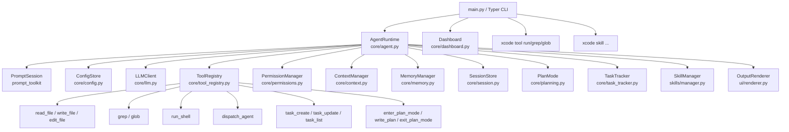
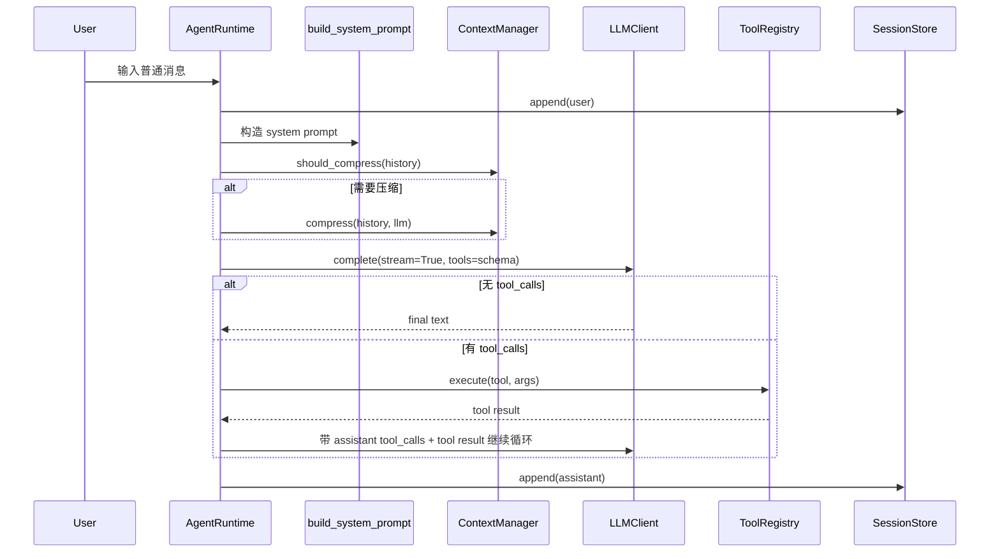
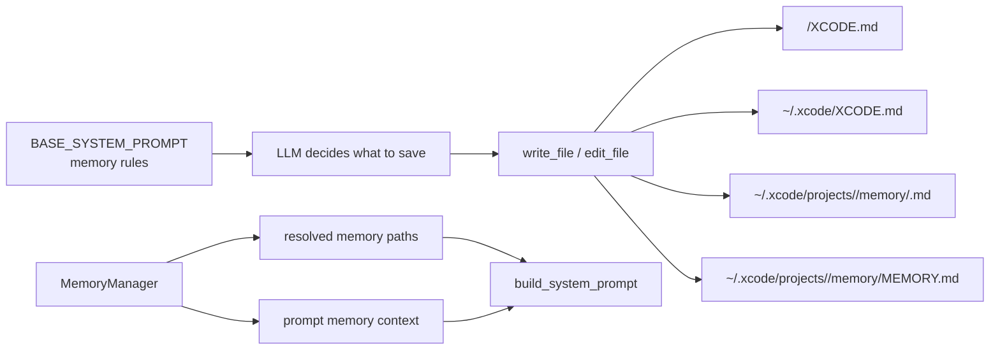

# Xcode 当前架构

> 本文档只描述当前代码已经实现的系统。未来计划和未实现方案放在 `ROADMAP.md`，历史推进过程放在 `PROGRESS.md`，坑和设计取舍放在 `DEVNOTES.md`。

## 1. 系统定位

Xcode 是一个 terminal-native AI coding agent，核心形态是 Python CLI REPL。它通过 OpenAI-compatible API 调用 LLM，并向模型暴露文件、搜索、shell、子 Agent、任务追踪、计划模式和记忆相关工具。

当前版本的主循环是同步实现，不引入 `asyncio`。并发只用于子 Agent，由 `ThreadPoolExecutor` 承担。

## 2. 组件关系图



## 3. 入口和主循环

`src/xcode_cli/main.py` 使用 Typer 暴露这些入口：

| 入口 | 当前行为 |
|------|----------|
| `xcode` | 没有子命令时直接启动 `AgentRuntime().run_chat()` |
| `xcode chat` | 启动交互式聊天 |
| `xcode dashboard` | 打开 API 配置 TUI |
| `xcode tool run` | 直接运行 read/write/edit/shell/grep/glob |
| `xcode tool grep` / `xcode tool glob` | PowerShell 友好的搜索子命令 |
| `xcode skill install/list/enable/disable` | 管理本地 skill |

`AgentRuntime.run_chat()` 是 REPL 主循环。它负责创建 session id、读取用户输入、处理 slash command、构造 system prompt、调用 `_run_llm_loop()`，并把用户和 assistant 最终文本追加到 JSONL session 日志。

## 4. 普通对话数据流



当前真正参与 LLM 推理的对话状态是运行时内存里的 `self._history`。`SessionStore` 会写 JSONL 日志，但现在没有从日志恢复为 `history` 的入口。

## 5. Slash Command 流程

用户输入以 `/` 开头时不会进入 LLM，而是由 `_handle_slash_command()` 分发：

| 命令 | 实现位置 | 当前能力 |
|------|----------|----------|
| `/help` | `agent.py` | 展示命令列表 |
| `/context` | `_handle_context_command()` | 展示 token 估算、预算、压缩阈值和消息数 |
| `/dashboard` | `Dashboard().run()` | 打开 API 配置界面 |
| `/skill` | `_handle_skill_command()` | list/install/enable/disable |
| `/env` | `_handle_env_command()` | API key、base-url、model、theme、max-tokens、config edit |
| `/plan` | `_handle_plan_command()` | enter/show/approve/reject |
| `/memory` | `_handle_memory_command()` | 查看 memory 状态，开关 auto memory |
| `/exit` | `run_chat()` | 退出 |

## 6. Tool 系统

工具定义由 `ToolDef` 表达，字段包括：

| 字段 | 用途 |
|------|------|
| `name` | OpenAI function name |
| `description` | 暴露给 LLM 的说明 |
| `parameters` / `required` | JSON schema |
| `execute` | 本地执行函数 |
| `is_read_only` | 权限系统用于区分只读和危险操作 |

`ToolRegistry.get_openai_schemas()` 把工具转换成 OpenAI-compatible tool schema。`ToolRegistry.execute()` 捕获所有工具异常并返回 `"Tool error: ..."`，避免单个工具异常打崩 Agent 主循环。

当前 13 个内置工具：

| 类别 | 工具 |
|------|------|
| 文件 | `read_file`, `write_file`, `edit_file` |
| 搜索 | `grep`, `glob` |
| Shell | `run_shell` |
| 子 Agent | `dispatch_agent` |
| 任务 | `task_create`, `task_update`, `task_list` |
| 计划模式 | `enter_plan_mode`, `write_plan`, `exit_plan_mode` |

## 7. 权限和审批模型

权限优先级：

```text
session rule > project .xcode/settings.json > global ~/.xcode/settings.json > default
```

默认策略：

| 工具 | 默认权限 |
|------|----------|
| `read_file`, `grep`, `glob` | `allow` |
| `write_file`, `edit_file`, `run_shell` | `ask` |
| 其他工具 | `ask` |

当权限为 `ask` 时，`AgentRuntime` 会在执行前展示工具调用信息。对 `write_file` / `edit_file`，还会先读取旧内容并渲染 diff preview，再出现审批 UI。

TTY 环境下审批 UI 是内联三选项菜单：

```text
Yes
No
Yes, for this conversation
```

支持方向键上下选择 + Enter，也保留 `y/n/a` 快捷键。非 TTY fallback 才退回单行 `input()`。

## 8. Memory 模型

当前 memory 是文件驱动模型，不提供专用 `memory_save/list/get/delete` 工具。



`MemoryManager` 只负责路径管理、读取 Project/User XCODE.md、读取 auto memory index，以及向 prompt 注入 memory context。是否记、记什么、写到哪里，由 `BASE_SYSTEM_PROMPT` 规则驱动 LLM 使用文件工具完成。

注入顺序在 `build_system_prompt()` 中固定：

1. `BASE_SYSTEM_PROMPT`
2. 当前 working directory
3. 当前项目 resolved memory paths
4. enabled skills 的 `SKILL.md`
5. Project XCODE.md、User XCODE.md、Auto Memory Index

Auto memory 当前只自动注入 `MEMORY.md` 索引，详细内容需要 Agent 再用 `read_file` 读取具体 memory 文件。

## 9. Context 模型

`ContextManager` 持有实例级 `max_tokens`，由 `Config.max_tokens` 初始化，并在 `/env max-tokens <value>` 时同步更新。

当前能力：

| 能力 | 实现 |
|------|------|
| token 估算 | 按 ASCII / 非 ASCII 字符粗略估算，并计入 reasoning、tool_calls、tool_call_id |
| 压缩触发 | `estimate_tokens(history) >= max_tokens * 0.8` |
| 压缩方式 | 保留第一条 user message、压缩中间消息、保留最近 8 条 |
| 摘要语言 | 英文压缩提示词 |
| `/context` | 展示当前估算、预算、阈值、消息数量 |

当前 `/context` 还没有 cost 估算。

## 10. Session 当前边界

`SessionStore` 会把 user 和 assistant 的最终文本追加到：

```text
~/.xcode/sessions/<session_id>.jsonl
```

每条记录包含：

```json
{"role": "user|assistant", "content": "...", "ts": "..."}
```

当前限制：

- `run_chat()` 每次启动都会创建新的 session id。
- session JSONL 是日志，不是可恢复状态。
- 没有 `--resume` / `--continue` 入口。
- 没有从 JSONL 重建 `history` 的逻辑。
- tool messages、assistant tool_calls、压缩 summary 等运行时细节没有完整持久化。

因此现在不能真正“回退对话”或“恢复对话”，只能重开会话或在语义上要求模型忽略上一轮。

## 11. 当前文件职责

| 文件 | 职责 |
|------|------|
| `src/xcode_cli/core/agent.py` | REPL 主循环、slash commands、工具注册、审批 UI、LLM/tool loop |
| `src/xcode_cli/core/llm.py` | OpenAI-compatible API 调用、streaming、tool call 解析 |
| `src/xcode_cli/core/tool_registry.py` | 工具定义、schema 转换、异常捕获执行 |
| `src/xcode_cli/core/tools/files.py` | read/write/edit 文件工具 |
| `src/xcode_cli/core/tools/search.py` | ripgrep 和 glob 搜索工具 |
| `src/xcode_cli/core/tools/shell.py` | shell 执行工具 |
| `src/xcode_cli/core/permissions.py` | session/project/global 三级权限 |
| `src/xcode_cli/core/context.py` | token 估算和历史压缩 |
| `src/xcode_cli/core/memory.py` | memory 路径、读取和 prompt context 注入 |
| `src/xcode_cli/core/prompting.py` | base system prompt、memory 规则、skill 注入 |
| `src/xcode_cli/core/session.py` | JSONL session 日志写入 |
| `src/xcode_cli/core/planning.py` | plan mode 状态机和 plan 文件写入 |
| `src/xcode_cli/core/task_tracker.py` | task CRUD 和 task 工具工厂 |
| `src/xcode_cli/core/sub_agent.py` | 子 Agent 执行 |
| `src/xcode_cli/ui/renderer.py` | Rich Markdown / diff 渲染 |

## 12. 当前架构边界

- 不引入 `asyncio`。
- 不提供专用 memory CRUD 工具。
- 子 Agent 不递归派发子 Agent。
- 配置主要来自 `~/.xcode/config.json`，项目级配置合并尚未完成。
- 权限 project 级规则已经读取 `.xcode/settings.json`，但这不是完整 Config merge。
- prompt_toolkit 在 Git Bash / mingw 等非原生 Windows 控制台中有已知限制，关键交互应在 cmd.exe 或 PowerShell 验收。
