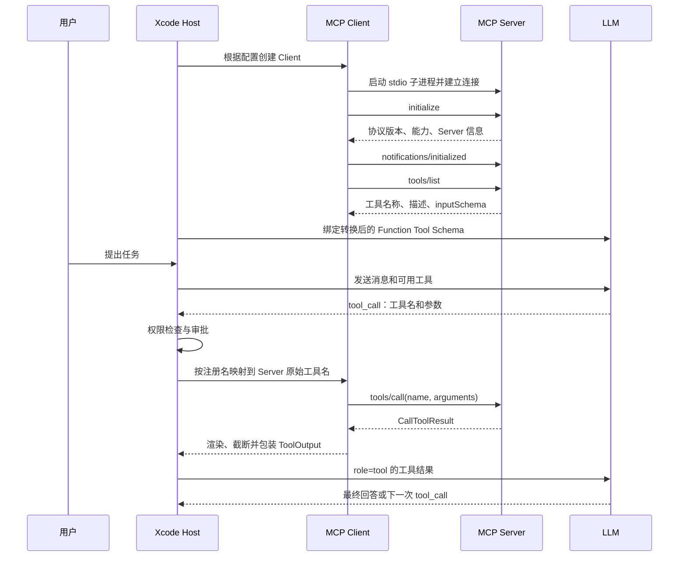
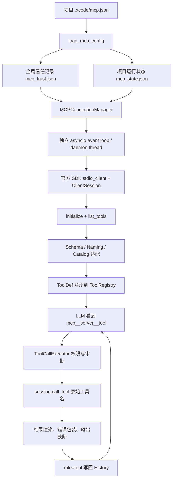

# MCP 知识与 Xcode 项目实现手册

状态：知识说明文档，已按当前代码实现和官方 MCP 文档核对。

日期：2026-07-14

## 1. 先用一句话理解 MCP

MCP（Model Context Protocol，模型上下文协议）是一套让 AI 应用以统一方式连接外部工具、数据和工作流的开放协议。

它解决的是“AI 应用怎样发现和调用外部能力”的接口标准化问题，而不是替模型做推理，也不是一个 Agent 框架。

可以把它类比为 AI 应用领域的通用外设接口：不同 Server 只要遵守同一协议，Host 就可以用相似的连接、发现和调用流程接入它们。

## 2. MCP 的三个参与者

| 角色 | 作用 | 在 Xcode 项目中的对应物 |
|---|---|---|
| MCP Host | 用户直接使用的 AI 应用，管理模型、上下文、权限和多个 MCP Client | Xcode Agent |
| MCP Client | 与某一个 MCP Server 建立并维护协议会话 | `MCPConnectionManager` 管理的 `ClientSession` |
| MCP Server | 暴露工具、资源或提示词的独立程序 | `fake_mcp_server.py`、Sequential Thinking Server |

一个 Host 可以连接多个 Server。概念上，每个 Client 与一个 Server 保持一条独立连接。

需要注意：“Server”表示协议中的能力提供方，不等于它一定部署在远程机器上。使用 `stdio` 时，Server 通常就是 Host 在本机启动的子进程。

## 3. MCP 标准提供什么

### 3.1 Server 可以暴露的核心能力

| 能力 | 作用 | 常见方法 | 通常由谁选择使用 |
|---|---|---|---|
| Tools | 可执行动作，例如查数据库、写文件、调用 API | `tools/list`、`tools/call` | 模型 |
| Resources | 可读取的上下文数据，例如文件、数据库记录、Schema | `resources/list`、`resources/read` | Host/Application |
| Prompts | 可复用的提示模板或工作流入口 | `prompts/list`、`prompts/get` | 用户 |

当前 Xcode 只接入了 **Tools**，还没有接入 Resources 和 Prompts。

### 3.2 Client 侧能力

标准 MCP 还允许 Server 请求 Client 提供 Sampling、Elicitation、Logging 等能力，例如请求 Host 调用模型，或向用户补充提问。这些也不是当前 Xcode MCP 实现的重点。

### 3.3 传输层

MCP 当前主要有两种标准传输方式：

- `stdio`：Host 启动本地子进程，通过标准输入和标准输出交换 JSON-RPC 消息。
- Streamable HTTP：通过 HTTP 与远程 Server 通信，并可结合流式响应和认证机制。

当前 Xcode **只支持 `stdio`**，尚未实现远程 Streamable HTTP、OAuth 或 SSE 兼容路径。

## 4. MCP 和其他概念的区别

### 4.1 MCP 与 Function Calling

Function Calling 是模型与 Host 之间的调用表达：模型返回“我要调用某工具，并传这些参数”。

MCP 是 Host 与外部 Server 之间的通信协议：Host 通过 `tools/list` 发现工具，再通过 `tools/call` 请求 Server 执行。

二者在 Xcode 中的关系是：

```text
模型 Function Call
        ↓
Xcode Tool Registry / Tool Executor
        ↓
MCP Client 的 tools/call
        ↓
MCP Server
```

因此，MCP 工具最终也会以 Function Calling Schema 暴露给模型，但 Function Calling 本身不等于 MCP。

### 4.2 MCP 与 Skill

| 维度 | Skill | MCP |
|---|---|---|
| 本质 | 提示词、知识和工作流说明 | 客户端与外部能力之间的标准协议 |
| 主要内容 | Markdown 指令正文 | Tool/Resource/Prompt 描述及协议请求 |
| 是否执行外部程序 | 通常不直接执行 | 可以启动进程、调用 API、访问外部系统 |
| 能力发现 | Xcode 扫描 Skill 元数据 | Client 调用 `tools/list` 等方法 |
| 模型看到什么 | Skill 的名称、描述，按需再读取正文 | Tool 名称、描述和参数 Schema |
| 运行结果 | 主要是给下一轮模型增加指令上下文 | 返回外部执行结果，再写回模型上下文 |

在 Xcode 里，两者都可能被统一包装成模型可调用的 `ToolDef`，所以表面上很像；但底层执行语义不同：Skill Tool 的核心结果是“取回指令正文”，MCP Tool 的核心结果是“跨进程调用外部能力”。

### 4.3 MCP 与 ReAct

MCP 不会让一个 Agent 自动变成 ReAct。ReAct-like 循环由 Xcode 的 Agent Runtime 实现：模型观察上下文、决定行动、执行工具、读取结果，再继续推理。

MCP 只是向这个循环增加了一类标准化的 Action。即使完全没有 MCP，Xcode 仍然可以通过内置工具运行同样的工具循环。

### 4.4 MCP 与普通 API

普通 API 通常需要 Host 针对每个服务手写客户端、接口和参数适配。MCP 在 API 外增加了统一的发现、Schema、生命周期和调用约定，使 Host 可以用相同框架连接不同能力。

Server 内部依然可以调用普通 REST API、数据库或本地库。MCP 替代的不是所有 API，而是 AI Host 接入这些能力时重复编写的适配层。

## 5. 标准 MCP 工具调用流程

下面这条链路是正确的主干，但要区分哪些步骤属于 MCP，哪些属于 Agent Runtime：



这里有三个重要修正：

1. Client 不会自动扫描整台电脑寻找 MCP Server；Xcode 先从项目配置中知道要启动哪些 Server。
2. `initialize` 必须先于正常操作，`tools/list` 不是建立连接后的第一条协议消息。
3. 不是“Agent SDK 决定调用哪个工具”，而是模型结合用户问题和 Tool Schema 生成调用意图；Agent Runtime 负责校验、权限、执行和回填结果。

## 6. Tool Schema 与参数是谁决定的

Server 在 `tools/list` 中返回每个工具的：

- `name`：工具标识。
- `description`：工具做什么、什么时候适合使用。
- `inputSchema`：基于 JSON Schema 的参数定义，包括属性、类型和必填项。

示例：

```json
{
  "name": "echo",
  "description": "Echo text for Xcode MCP manual testing.",
  "inputSchema": {
    "type": "object",
    "properties": {
      "text": { "type": "string" }
    },
    "required": ["text"]
  }
}
```

Xcode 把它转换成内部 `ToolDef`，再把工具 Schema 发给模型。模型根据用户输入、工具描述和 Schema 决定是否调用，以及给 `text` 填什么值。

因此可以概括为：

- Server 定义“有哪些参数、参数是什么类型、哪些必填”。
- 模型决定“本次调用具体填什么参数值”。
- Host 负责调用格式、权限和运行期错误处理。
- Server 对业务参数和真实执行结果负最终责任。

Schema 能显著约束模型输出，但不能假设模型永远填写正确，所以 Host 和 Server 仍需要处理缺参、类型错误、未知工具和执行异常。

## 7. 两种容易混淆的 Tool Call 格式

### 7.1 模型返回给 Xcode 的 Function Tool Call

```json
{
  "role": "assistant",
  "tool_calls": [
    {
      "id": "call_123",
      "type": "function",
      "function": {
        "name": "mcp__fake__echo",
        "arguments": "{\"text\":\"hello\"}"
      }
    }
  ]
}
```

这里的 `arguments` 通常是 JSON 字符串。Xcode 解析后形成内部 ToolCall，再交给工具执行器。

### 7.2 Xcode Client 发给 MCP Server 的 JSON-RPC 请求

```json
{
  "jsonrpc": "2.0",
  "id": 3,
  "method": "tools/call",
  "params": {
    "name": "echo",
    "arguments": {
      "text": "hello"
    }
  }
}
```

注意名称变化：模型看到的是防冲突后的 `mcp__fake__echo`，Server 收到的是自己的原始工具名 `echo`。

### 7.3 MCP Server 返回的结果

```json
{
  "jsonrpc": "2.0",
  "id": 3,
  "result": {
    "content": [
      { "type": "text", "text": "echo: hello" }
    ],
    "isError": false
  }
}
```

Xcode 渲染这个结果后，会写回类似下面的模型历史消息：

```json
{
  "role": "tool",
  "tool_call_id": "call_123",
  "content": "echo: hello"
}
```

`tool_calls[].id` 与 `role=tool` 消息的 `tool_call_id` 必须配对。工具业务失败也应作为工具结果返回给模型，而不是让整个 Agent 循环崩溃。

## 8. Xcode 中 MCP 的实现定位

当前项目实现的是一个 **MCP Client 集成层**，不是从零实现完整 MCP 协议，也不是一个 MCP 安装市场。

项目使用官方 Python SDK：

```python
from mcp import ClientSession, StdioServerParameters
from mcp.client.stdio import stdio_client
```

SDK 负责 stdio 传输、JSON-RPC 消息和 MCP Session 等底层协议工作；Xcode 自己负责配置、信任、连接管理、工具适配、权限、状态、UI 命令和 Agent 工具循环。

截至本文日期：

- 项目依赖声明是 `mcp>=1.0.0`。
- 当前本地环境安装的是 `mcp 1.27.2`。
- 官方 Python SDK README 将 v1.x 标为当前稳定版本，v2 仍处于预发布阶段，并建议依赖方增加 `<2` 上界。项目当前依赖约束仍存在未来被 v2 破坏性升级影响的风险。

## 9. Xcode 的完整实现链路



Xcode 的主 REPL、`AgentRuntime`、`LLMClient.complete()` 和工具执行入口仍然是同步接口。MCP 在专用线程中运行一个 `asyncio` event loop，并通过同步 wrapper、超时和取消机制对主流程提供服务。这种设计避免了为了接入异步 SDK 而把整个 Agent 主循环全局异步化。

## 10. 关键代码分工

| 文件 | 职责 |
|---|---|
| `src/xcode_cli/mcp/config.py` | 读取项目 `.xcode/mcp.json`，解析 Server、变量、过滤规则和默认输出上限 |
| `src/xcode_cli/mcp/trust.py` | 计算配置指纹，读写全局信任记录 |
| `src/xcode_cli/mcp/state.py` | 保存项目级 Server/Tool 启停状态和单工具输出限制 |
| `src/xcode_cli/mcp/connection.py` | 管理事件循环、SDK Session、连接、刷新、重连、调用和关闭 |
| `src/xcode_cli/mcp/schema.py` | 把 MCP `inputSchema` 转成内部参数 Schema，并报告无效结构 |
| `src/xcode_cli/mcp/naming.py` | 清洗名称并生成 `mcp__server__tool`，检测重名冲突 |
| `src/xcode_cli/mcp/catalog.py` | 定义工具目录项和工具状态信息 |
| `src/xcode_cli/mcp/tools.py` | 结合配置、运行状态和连接结果创建 `ToolDef` |
| `src/xcode_cli/mcp/result.py` | 渲染文本或结构化结果，标记错误，省略暂不支持的媒体并截断超长输出 |
| `src/xcode_cli/mcp/events.py` | 记录连接、刷新、重连等生命周期事件 |
| `src/xcode_cli/mcp/status.py` | 定义 Server/Tool 状态数据 |
| `src/xcode_cli/core/agent.py` | 初始化 MCP、注册工具、处理 `/mcp` 命令并接入 Agent 生命周期 |
| `src/xcode_cli/core/tool_registry.py` | 统一保存和执行内置、Skill、MCP 等 `ToolDef` |
| `src/xcode_cli/core/tooling/execution.py` | 处理模型 ToolCall、权限、审批、异常和 ToolResult |

测试用的 [`examples/fake_mcp_server.py`](../../examples/fake_mcp_server.py) 是手写的最小 JSON-RPC/MCP Server，只实现 `initialize`、`tools/list` 和 `tools/call`，用于 Windows stdio、错误结果和输出截断验收。它没有使用 FastMCP，因此不代表生产 Server 的推荐完整写法。

## 11. Xcode 去哪里找 MCP 配置

Xcode 只读取：

```text
<project-root>/.xcode/mcp.json
```

项目根目录的解析优先级是：

1. 显式传入的项目根目录。
2. 环境变量 `XCODE_PROJECT_ROOT`。
3. 从当前目录向上查找 `.git`、`pyproject.toml` 或 `package.json`。
4. 都找不到时使用当前目录。

Xcode 当前不会扫描这些位置来自动发现 Server：

- 全局 `node_modules`。
- Python 环境中的所有包。
- 用户下载目录。
- 其他项目的 `.xcode/mcp.json`。
- 网络上的 MCP Server 市场。

所以当前“安装一个 MCP Server”实际上分为两步：

1. 用 `pip`、`npm`、源码或可执行文件把 Server 安装到某个位置。
2. 手动在项目 `.xcode/mcp.json` 中填写启动它的 `command`、`args`、`cwd` 和 `env`。

Server 文件本身不要求安装在 `.xcode` 目录里，只要配置中的命令能够找到并启动它即可。

## 12. `mcp.json` 配置说明

当前项目的简化示例：

```json
{
  "mcpServers": {
    "fake": {
      "type": "stdio",
      "command": "python",
      "args": ["${workspace}\\examples\\fake_mcp_server.py"],
      "cwd": "${workspace}",
      "env": {
        "FAKE_MCP_LOG": "${workspace}\\examples\\fake_mcp_server.log"
      },
      "enabled": true,
      "tool_allowlist": ["echo", "long_output"],
      "tool_blocklist": [],
      "read_only_tools": ["echo"]
    }
  },
  "max_mcp_output_chars": 20000
}
```

| 字段 | 含义 |
|---|---|
| `mcpServers` | 以 Server 名为键的配置对象 |
| `type` | 当前只接受 `stdio` |
| `command` | 启动进程的命令，例如 `python`、`node`、`npx` |
| `args` | 传给启动命令的参数，不是工具调用参数 |
| `cwd` | Server 子进程的工作目录 |
| `env` | 为 Server 子进程附加或覆盖的环境变量 |
| `enabled` | 配置层是否启用 Server，默认 `true` |
| `tool_allowlist` | 只暴露列出的工具；为空时不限制 |
| `tool_blocklist` | 不暴露列出的工具 |
| `read_only_tools` | 明确声明为只读的工具名；未声明时默认按非只读处理 |
| `max_mcp_output_chars` | 全局 MCP 结果字符上限，默认 20000 |

`${workspace}` 会展开为项目根目录。配置也支持读取宿主环境变量，但缺失变量会产生警告。

### `cwd` 到底有什么用

`cwd` 是 Server 子进程启动后的当前工作目录。它会影响：

- Server 内部相对路径从哪里开始解析。
- Server 读取哪个项目的配置或文件。
- Server 再启动其他子命令时的默认目录。

`cwd` **不是权限沙箱**，不会自动限制 Server 只能访问这个目录。真正的权限边界仍依赖操作系统权限、容器/沙箱和 Xcode 自己的工具审批策略。

## 13. 与 MCP 有关的三个持久化文件

严格来说，只有第一个是 Server 声明配置；另外两个分别是信任和运行状态。

| 文件 | 范围 | 保存内容 |
|---|---|---|
| `<project>/.xcode/mcp.json` | 项目级 | Server 启动声明、工具过滤、只读声明、默认输出上限 |
| `~/.xcode/mcp_trust.json` | 用户全局文件，内部按项目分组 | 每个项目中已信任 Server 的配置指纹 |
| `~/.xcode/projects/<project-key>/mcp_state.json` | 项目级状态 | Server/Tool 本地启停覆盖和单工具输出上限 |

工具的 `allow`、`ask`、`deny` 权限不是这三个文件负责的，它来自 Xcode 的权限配置，例如项目或全局 `settings.json`。

当前仓库的 `.gitignore` 忽略整个 `.xcode/`，因此本机的 `mcp.json` 和其中安装的本地 Server 不会被 Git 跟踪。这意味着别人 `git clone` 或 `git pull` 后，不会自然获得这部分本地配置，需要文档、示例配置或安装命令另行补齐。

## 14. 信任、禁用与权限的区别

| 操作 | 改变什么 | 是否删除其他状态 | 以后如何恢复 |
|---|---|---|---|
| `/mcp disable <server>` | 在项目状态中禁用 Server，不连接也不暴露工具 | 保留信任记录和 Tool 状态 | `/mcp enable <server>` |
| `/mcp untrust <server>` | 删除当前项目下该 Server 的信任指纹 | 保留启停和 Tool 状态 | 重新 `/mcp trust <server>` |
| Permission `deny` | 拒绝某个已注册工具的执行 | Server 仍可能连接，工具仍可能出现在目录中 | 修改权限配置 |

`enable` 不等于 `trust`，`trust` 也不等于 Permission `allow`：

- Enable 决定是否启用这项配置。
- Trust 决定 Xcode 是否允许按该启动配置执行 Server 进程。
- Permission 决定某次模型工具调用是直接允许、询问还是拒绝。

### 为什么换一个项目还要重新信任

信任指纹包含：

- `project_key`
- Server 名称和类型
- `command`
- `args`
- 解析后的 `cwd`
- 排序后的环境变量键名

因此，同一个 Server 在另一个项目路径下会得到不同的项目记录，需要重新信任。

同时必须认识到当前信任模型的边界：指纹没有哈希 Server 脚本、二进制文件内容和环境变量值。它证明的是“用户同意过这份启动配置”，不是“Server 代码从未被篡改”。如果原路径下的脚本内容被替换，配置指纹可能仍然不变。

## 15. `/mcp` 命令速查

| 命令 | 作用 |
|---|---|
| `/mcp` | 等价于查看状态 |
| `/mcp status` | 查看各 Server 的连接、信任和工具数量 |
| `/mcp status --verbose` | 同时显示工具级目录和状态 |
| `/mcp tools [server]` | 查看全部或指定 Server 的 Tool Catalog |
| `/mcp reload` | 重新读取项目配置，关闭并重建相关连接和工具注册 |
| `/mcp enable <server>` | 取消项目状态层的禁用，但不会自动建立信任 |
| `/mcp disable <server>` | 在项目状态层禁用 Server |
| `/mcp tool enable <server> <tool>` | 在项目状态层启用某个已发现工具 |
| `/mcp tool disable <server> <tool>` | 隐藏某个工具，使其不再暴露给模型 |
| `/mcp refresh [server]` | 在现有连接上重新执行 `tools/list` 并重建工具注册 |
| `/mcp reconnect [server]` | 关闭并重新建立 Server 连接 |
| `/mcp events [server]` | 查看最近的连接、刷新和错误事件 |
| `/mcp output-limit <server> <tool> <chars>` | 设置单个工具的结果字符上限 |
| `/mcp output-limit <server> <tool> default` | 恢复该工具的默认结果上限 |
| `/mcp trust <server>` | 展示启动配置和指纹，确认后记录信任并重载 |
| `/mcp untrust <server>` | 撤销当前项目中该 Server 的信任并重载 |

`refresh`、`reconnect`、`reload` 的区别：

- `refresh`：连接不变，只刷新工具列表。
- `reconnect`：重启指定或全部 Server 会话。
- `reload`：重新读取 `mcp.json`，适合修改配置后使用。

如果 Server 声明支持 `notifications/tools/list_changed`，Xcode 的 SDK 消息处理器会先记录待刷新事件，再在主流程安全点重新执行 `tools/list` 和工具注册，避免后台线程直接修改正在使用的注册表。

## 16. 示例信任信息逐项解释

```text
MCP server: fake
command: python
args: D:\Xcode\examples\fake_mcp_server.py
cwd: D:\Xcode
env keys: FAKE_MCP_LOG
hash: sha256:...
Trust MCP server 'fake'? [y/N] y
MCP server 'fake' trusted.
```

- `MCP server: fake`：`mcp.json` 中的逻辑名称。
- `command: python`：Xcode 将要启动的可执行命令。
- `args`：传给 `python` 的进程参数，这里是 Server 脚本路径。
- `cwd`：该 Python 子进程的工作目录。
- `env keys`：会传给子进程的额外环境变量名称；界面不展示值，避免泄露秘密。
- `hash`：当前项目与启动配置的 SHA-256 指纹，不是 Server 文件内容哈希。
- `[y/N]`：默认是拒绝；只有输入 `y` 或 `yes` 才建立信任。
- `trusted`：信任记录已经写入，Xcode 随后可以启动该 Server；并不代表其工具绕过 Permission 检查。

由于 stdio 的标准输出是协议通道，Server 不能随意向 stdout 打调试日志，否则会污染 JSON-RPC 消息。`fake_mcp_server.py` 使用 `FAKE_MCP_LOG` 把日志写到文件，正是为了解决这个问题；诊断日志也可以写到 stderr。

## 17. 当前 Xcode 实现的安全与稳定性措施

当前实现已经包含：

- 未信任配置不启动。
- 配置变化会导致原信任指纹失效。
- 所有 MCP 工具都进入现有 `allow/ask/deny` 权限链路。
- 新发现工具只有显式列入 `read_only_tools` 才按只读处理。
- `tool_allowlist`、`tool_blocklist` 和 Tool 本地状态控制模型可见范围。
- Schema 非法、工具重名或名称清洗冲突时不盲目注册。
- 调用超时、SDK 异常和业务错误被包装成工具错误，避免单个 Server 让 Agent 主循环崩溃。
- Server 环境变量值会从错误信息中做脱敏处理。
- 超长结果按全局或单工具上限截断，减少上下文污染。
- 关闭 Xcode 时会清理 Session、子进程、event loop 和后台线程。

仍需注意的边界：

- 信任是启动配置授权，不是代码完整性校验。
- `cwd` 不是沙箱。
- 当前仅支持 stdio tools。
- MCP Server 具有其操作系统进程权限，恶意 Server 仍可能读取文件、访问网络或执行命令。
- 把太多 MCP Tool 全量暴露给模型会增加 Token、选错工具和命名冲突风险，应使用 allowlist、blocklist 或 Tool disable 控制规模。

## 18. 当前没有实现的能力

为了避免面试时夸大，应该明确当前边界：

- 没有实现 MCP Server 市场、搜索、下载或自动安装。
- 没有自动扫描本机 Server。
- 没有实现 Resources 和 Prompts 接入。
- 没有实现远程 Streamable HTTP、OAuth 和远程多租户连接。
- 没有实现完整的 Server 供应链校验或二进制内容签名。
- 没有自行实现完整 MCP 协议；协议层主要复用官方 Python SDK。

这不妨碍把它作为项目能力介绍，但准确说法应是“实现了 stdio MCP Tools 的 Client 接入、治理与 Agent Runtime 集成”，而不是“从零实现了完整 MCP”。

## 19. 面试时可以怎么讲

### 30 秒版本

> 我的项目在 Host/Client 侧接入了 MCP。Xcode 从项目级 `.xcode/mcp.json` 读取 stdio Server 配置，经过按项目隔离的配置指纹信任后，用官方 Python SDK 启动 Server、完成 initialize 和 tools/list。然后把 Server 返回的名称、描述和 inputSchema 转成内部 ToolDef，统一注册进 Agent 的 Tool Registry。模型通过 Function Calling 选择工具和参数，现有 ToolCallExecutor 继续负责 allow/ask/deny 权限与异常处理，最后由 ClientSession.call_tool 调用 Server，并把结果作为 role=tool 消息送回下一轮模型。当前范围是 stdio tools，没有把 Resources、Prompts 和远程 HTTP 说成已经实现。

### 如果问“你自己实现了什么”

> 协议编解码和 stdio Session 复用了官方 MCP Python SDK。我主要实现的是宿主侧工程化集成：项目配置解析、Server 配置指纹信任、项目状态隔离、专用 asyncio 线程与同步 Runtime 的桥接、工具名称和 JSON Schema 适配、Tool Registry 注册、动态 tools/list_changed 刷新、输出截断、错误脱敏、权限接入，以及 `/mcp` 的状态与管理命令。

### 如果问“MCP 与 Skill 是不是一样”

> 在我的 Runtime 中两者最终都能包装成模型可见工具，所以入口形式相似；但 Skill 主要注入说明和工作流正文，MCP 是 Host 与外部进程或服务之间的标准协议。Skill Tool 执行后主要让模型读到指导文本，MCP Tool 执行后拿到的是外部系统的真实运行结果。

### 如果问“参数是谁填的”

> Server 用 inputSchema 定义参数结构，Host 把 Schema 交给模型，模型结合用户意图生成本次 arguments。Host 和 Server 仍要做校验和错误处理，因为 Schema 只能约束模型，不能保证输出永远合法。

## 20. 常见误区

- **错误**：MCP Server 会被 Client 自动扫描出来；**正确**：Xcode 先从项目配置知道启动哪个 Server，再通过协议发现它暴露的工具。

- **错误**：`tools/list` 会把 Python 函数源码发给模型；**正确**：它返回工具元数据和输入 Schema，不返回函数实现。

- **错误**：模型直接调用 MCP Server；**正确**：模型只生成 ToolCall，Host/Client 执行真实协议调用。

- **错误**：信任后工具会自动放行；**正确**：信任只允许启动 Server，工具仍经过权限层。

- **错误**：禁用和撤销信任相同；**正确**：禁用保留信任，撤销信任删除配置授权记录。

- **错误**：`cwd` 会把 Server 限制在项目目录；**正确**：`cwd` 只是进程工作目录，不是文件系统沙箱。

- **错误**：接入 MCP 就等于实现了 ReAct；**正确**：ReAct-like 循环属于 Agent Runtime，MCP 只是提供一种 Action 来源。

## 21. 官方资料与本项目入口

官方资料：

- [MCP Introduction](https://modelcontextprotocol.io/docs/getting-started/intro)
- [MCP Architecture Overview](https://modelcontextprotocol.io/docs/learn/architecture)
- [MCP Server Concepts](https://modelcontextprotocol.io/docs/learn/server-concepts)
- [MCP Lifecycle Specification](https://modelcontextprotocol.io/specification/2025-06-18/basic/lifecycle)
- [MCP Tools Specification](https://modelcontextprotocol.io/specification/2025-06-18/server/tools)
- [Official MCP Python SDK](https://github.com/modelcontextprotocol/python-sdk)

项目代码入口：

- [`src/xcode_cli/mcp/`](../../src/xcode_cli/mcp/)
- [`src/xcode_cli/core/agent.py`](../../src/xcode_cli/core/agent.py)
- [`src/xcode_cli/core/tool_registry.py`](../../src/xcode_cli/core/tool_registry.py)
- [`src/xcode_cli/core/tooling/execution.py`](../../src/xcode_cli/core/tooling/execution.py)
- [`examples/fake_mcp_server.py`](../../examples/fake_mcp_server.py)
- [`tests/test_mcp_connection.py`](../../tests/test_mcp_connection.py)
- [`tests/test_mcp_agent_integration.py`](../../tests/test_mcp_agent_integration.py)
- [`tests/test_mcp_management_command.py`](../../tests/test_mcp_management_command.py)
