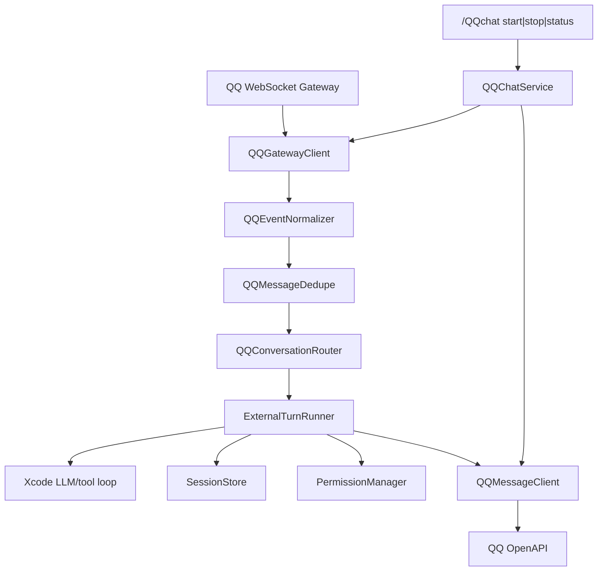

# QQ Chat Integration Design

> 本文档定义 Xcode 接入 QQ 机器人的目标架构。当前只完成调研与设计，不代表 `/QQchat` 已经实现。

## 背景

Xcode 当前是 terminal-native AI coding agent。普通对话已经收口到 `AgentRuntime._run_user_turn()`，该路径负责 session transcript、history、system prompt、LLM/tool loop 和 assistant 结果追加。slash command 已经由 `SlashCommandDispatcher` 分发，并区分 prompt command 与 side-effect command。

ROADMAP 已把“外部聊天入口”记录为 Phase 6 候选方向。QQ 接入是这个方向的第一个具体方案：通过 QQ 机器人 API v2，把 QQ 单聊或群聊 @ 消息转换为 Xcode 的外部 user turn。

## Review 更新结论

本轮按 `AGENTS.md` 重新审查后，QQ 接入必须先保持在架构规划和任务拆解层面，不直接跳到功能代码。实现时也不能把 QQ 逻辑塞回 `agent.py` 的主 REPL 循环里，而应新增外部入口适配层，并复用当前已经稳定的 user turn、session、tool loop 和权限边界。

关键修正：

- `/QQchat` 是 side-effect slash command，只负责启动、停止和查看 QQ bot 连接状态；它不是 prompt command，也不应进入 `_run_user_turn()`。
- QQ WebSocket 后台线程不能直接读写当前 REPL 的 `_history`，否则会污染本地 CLI 会话和其他 QQ 用户会话。
- 第一版必须新增或抽出 `ExternalTurnRunner`，让外部消息可以在独立 session/history 中运行，并把最终 assistant 文本返回给 QQ 回复层。
- QQ turn 默认使用入口级 `ToolScope` 收窄工具可见性和执行能力，必须在 tool schema 暴露层和 execution 层同时生效，不能只依赖 prompt 约束。
- QQchat 不能复用 skill frontmatter 的 `allowed-tools` 作为外部入口权限字段；skill `allowed-tools` 是 skill metadata，不是当前 turn 的严格白名单。
- 不引入 `asyncio`。QQ OpenAPI 和 WebSocket 推荐使用同步 HTTP transport 与 `websocket-client`，后台心跳使用 `threading.Thread`。
- 第一版只做被动回复，不做主动推送、富媒体、频道、公域消息、远程审批或危险工具执行。

## 目标

- 用户可以在 Xcode CLI 中输入 `/QQchat start` 启动 QQ 机器人连接。
- QQ 单聊机器人时，可以和 Xcode 对话。
- QQ 群里 @ 机器人时，可以和 Xcode 对话。
- QQ 消息复用 Xcode 的 LLM/tool loop、session、context compression 和权限系统。
- 每个 QQ 外部会话有独立 Xcode session，避免上下文串线。
- 默认只允许只读工具，远程 QQ 用户不能直接执行危险操作。
- 所有 QQ 事件、回复、工具调用和审批边界可审计。

## 非目标

- 不在第一版支持 QQ 主动推送。
- 不在第一版支持富媒体、Markdown、Ark、Embed、Keyboard。
- 不在第一版支持频道、公域频道全量消息或私信。
- 不在第一版允许 QQ 用户触发 `write_file`、`edit_file`、`run_shell`。
- 不引入 `asyncio`。
- 不把官方 `botpy` SDK 作为默认路径，除非后续确认它不会把项目拖入异步架构。
- 不把 QQ 接入做成 project skill。`/QQchat` 是 side-effect command，不是 prompt command。

## 官方平台约束

调研日期：2026-06-05。

QQ 机器人 API v2 当前关键约束：

- OpenAPI 通过 `AccessToken` 鉴权。
- AccessToken 通过 `POST https://bots.qq.com/app/getAppAccessToken` 获取，请求参数为 `appId` 和 `clientSecret`。
- OpenAPI 统一地址是 `https://api.sgroup.qq.com`。
- 请求头格式是 `Authorization: QQBot {ACCESS_TOKEN}`。
- WebSocket 连接前调用 `GET /gateway` 获取 WSS 地址。
- WebSocket Hello 使用 `op=10` 下发 `heartbeat_interval`。
- Identify 使用 `op=2`，`d.token` 也是 `QQBot {AccessToken}`。
- WebSocket heartbeat 使用 `op=1`，`d` 是客户端收到的最新 `s`，首次可为 `null`。
- Resume 使用 `op=6`，需要保存 `session_id` 和最新 `seq`。
- 单聊和群聊 @ 机器人都使用 `GROUP_AND_C2C_EVENT (1 << 25)`。
- 单聊事件 `C2C_MESSAGE_CREATE` 中，用户身份是 `author.user_openid`。
- 群聊事件 `GROUP_AT_MESSAGE_CREATE` 中，群身份是 `group_openid`，群内用户身份是 `author.member_openid`。
- 被动回复需要使用前置消息 `msg_id`，并用 `msg_seq` 防止重复回复。
- 单聊被动回复窗口为 60 分钟，群聊被动回复窗口为 5 分钟。

## 架构方案

推荐采用 WebSocket 本地连接方案：



### 为什么选择 WebSocket

WebSocket 更适合本地 CLI：

- 不需要把本机暴露成公网 HTTPS 回调服务。
- 不需要处理 Webhook 回调地址验证和 Ed25519 签名回包。
- `/QQchat start` 可以在本地进程内建立长连接。

Webhook 仍可作为后续部署型方案，但不是第一版。

## 核心组件

### QQChatConfig

负责读取 QQ 接入配置。

来源优先级：

1. 环境变量：`QQ_BOT_APP_ID`、`QQ_BOT_CLIENT_SECRET`
2. 用户级配置：`~/.xcode/qqchat.json`
3. 项目级非敏感配置：`.xcode/config.json` 的 `qqchat` 字段

约束：

- `client_secret` 只能来自环境变量或用户级配置。
- 项目级配置只能保存 allowlist、启用场景、默认 `ToolScope`、超时和回复长度。
- 配置加载失败必须返回可读错误，不能打崩 Agent 主循环。

### QQAuthClient

职责：

- 调用 `getAppAccessToken`。
- 缓存 `access_token` 和过期时间。
- 距离过期不足 60 秒时刷新。
- 对 HTTP 错误返回可读错误。

### QQGatewayClient

职责：

- 调用 `GET /gateway`。
- 建立 WebSocket 连接。
- 处理 `op=10 Hello`、`op=2 Identify`、`op=1 Heartbeat`、`op=6 Resume`。
- 记录最新 `seq` 和 `session_id`。
- 处理 reconnect、invalid session 和 heartbeat ACK 超时。

实现建议：

- 使用同步 `websocket-client` 包。
- 心跳使用 `threading.Thread`。
- 不使用 `asyncio`。
- WebSocket 线程只把事件放入 queue，不直接改 Xcode runtime 状态。

### QQMessageClient

职责：

- 发送单聊被动回复：`POST /v2/users/{openid}/messages`。
- 发送群聊被动回复：`POST /v2/groups/{group_openid}/messages`。
- 使用 `content`、`msg_type=0`、`msg_id`、`msg_seq`。
- 处理超频、超时和发送失败。
- 对长文本做分段，并控制每条前置消息最多 5 次回复。

### QQEventNormalizer

把平台 payload 转成内部消息对象：

```python
@dataclass(frozen=True)
class QQIncomingMessage:
    event_id: str | None
    event_type: str
    message_id: str
    content: str
    timestamp: str | None
    conversation_key: str
    reply_target: QQReplyTarget
    author_openid: str | None
    group_openid: str | None
    member_openid: str | None
    raw_payload: dict[str, object]
```

只接受：

- `C2C_MESSAGE_CREATE`
- `GROUP_AT_MESSAGE_CREATE`

其他事件第一版记录后忽略。

### QQConversationRouter

负责外部会话映射。

默认 key：

- 单聊：`qq:c2c:{user_openid}`
- 群聊：`qq:group:{group_openid}:member:{member_openid}`

可选 group shared 模式：

- `qq:group:{group_openid}`

默认不启用 group shared，避免多人上下文污染。

### ExternalTurnRunner

这是实现成败的关键。不要让 QQ 线程直接调用当前 REPL 的 `_run_user_turn()`。

需要抽出一个可返回 assistant 文本的同步 turn runner。它可以由 `AgentRuntime` 构造并注入现有 `LLMClient`、`ConfigStore`、`ToolRegistry`、`PermissionManager`、`ContextManager` 和 `SessionStore`，但必须为每个外部 conversation key 持有独立 runtime state。

```python
from typing import Literal


@dataclass(frozen=True)
class ExternalTurnResult:
    text: str
    session_id: str
    error: str | None = None


@dataclass(frozen=True)
class ToolScope:
    source: Literal["qqchat"]
    visible_tools: tuple[str, ...]
    execution_allowlist: tuple[str, ...]
    remote_approval: bool = False


class ExternalTurnRunner:
    def run(
        self,
        conversation_key: str,
        turn: UserTurnInput,
        *,
        tool_scope: ToolScope | None = None,
    ) -> ExternalTurnResult:
        ...
```

职责：

- 为每个 `conversation_key` 维护独立 session id 和 history。
- 构造 `UserTurnInput`，display 内容带 QQ 来源，model 内容只暴露干净消息和安全边界。
- 默认设置 `ToolScope(source="qqchat", visible_tools=("read_file", "grep", "glob", "task_list"), execution_allowlist=("read_file", "grep", "glob", "task_list"), remote_approval=False)`，后续 tool schema 和 execution 都必须遵守。
- 如果当前 runtime 仍有 `UserTurnInput.allowed_tools` 兼容字段，只能由 `ToolScope.visible_tools` 映射而来；QQ 文档和配置不得把它与 skill `allowed-tools` 混用。
- 为 QQ turn 禁用 auto memory，或在 system prompt 中明确外部输入不可写 memory。
- 复用现有 LLM/tool loop 和 PermissionManager。
- 返回 final assistant text 给 QQMessageClient。

不要直接复用当前 REPL 的 `_history`，否则 QQ 多用户会污染本地 CLI 会话。

## Slash Command 设计

`/QQchat` 是 side-effect command：

```text
/QQchat start
/QQchat stop
/QQchat status
```

内部可以注册为 `/qqchat`，dispatcher 已经会把命令头 lower-case。

行为：

- `/QQchat start`：启动 `QQChatService`。
- `/QQchat stop`：停止 service 并关闭 WebSocket。
- `/QQchat status`：显示连接状态、gateway、session id、最新 seq、活动 QQ 会话数、默认 `ToolScope` 摘要。

不应让 `/QQchat` 返回 prompt，也不应进入 `_run_user_turn()`。

命令注册建议：

- `COMMANDS` 中展示 `/QQchat`，但 dispatcher 内部可以按 lower-case `/qqchat` 路由。
- `SlashCompleter` 对 `/QQchat`、`/QQchat start`、`/QQchat stop`、`/QQchat status` 提供补全。
- `SlashCommandDispatcher.__init__()` 新增 `qqchat_handler` 可选回调，避免让 dispatcher 直接依赖 `QQChatService`。
- `AgentRuntime.__init__()` 构造 QQ service 和 handler，但当前 service 未启动时不得影响普通 `xcode chat`。

## 权限模型

第一版 QQ turn 固定为 P0/P1 安全边界：

- 只读工具默认允许。
- `write_file`、`edit_file`、`run_shell`、git、安装依赖全部不暴露。
- 即使模型试图调用未暴露工具，execution 层也必须拒绝。
- 远程 QQ 用户不能审批危险操作。
- 后续如果要开放危险工具，必须通过本机 owner 在终端内审批。
- 所有 QQ 配置、事件和日志都不能保存 AppSecret、AccessToken 或完整 Authorization header。
- 群聊默认启用 allowlist 或至少显式显示未配置 allowlist 的风险提示。

### ToolScope 与 skill `allowed-tools`

- skill `allowed-tools` 采用 Claude-compatible 语义，是 skill 声明的工具需求、允许范围或可预授权提示；当前 Xcode 不把它当作 turn 级 exhaustive whitelist。
- QQchat 使用独立入口字段 `ToolScope` / `entry_tool_scope`，表达外部聊天入口在本轮能看见和能执行哪些工具。
- `ToolScope.visible_tools` 负责过滤模型可见 tool schemas；`ToolScope.execution_allowlist` 负责 execution 层二次拒绝。
- `ToolScope.remote_approval` 第一版固定为 `false`，QQ 远程用户不能审批危险工具。
- 有效工具集合应按 `registered_tools ∩ entry_tool_scope.visible_tools ∩ entry_tool_scope.execution_allowlist ∩ runtime_non_denied_tools` 收口，且不得因为 skill metadata 扩大。

建议新增项目级配置：

```json
{
  "qqchat": {
    "tool_scope": {
      "visible_tools": ["read_file", "grep", "glob", "task_list"],
      "execution_allowlist": ["read_file", "grep", "glob", "task_list"],
      "remote_approval": false
    },
    "enable_dangerous_tools": false,
    "require_owner_approval_for_dangerous_tools": true
  }
}
```

## 审计与持久化

建议新增事件类型：

```json
{
  "type": "external_message",
  "source": "qq",
  "conversation_key": "qq:c2c:...",
  "message_id": "ROBOT1.0_...",
  "event_type": "C2C_MESSAGE_CREATE",
  "content": "..."
}
```

普通 `message` event 仍记录 user/assistant，以便 `/resume` 能恢复 QQ 会话。

QQ metadata 不应包含：

- AppSecret
- AccessToken
- 完整 Authorization header
- 本地用户隐私配置

## 错误处理

所有错误都必须转为状态或可读消息：

- AccessToken 获取失败：`/QQchat status` 显示 auth error。
- Gateway 获取失败：service 不启动，返回错误。
- WebSocket 断开：进入 reconnect/resume。
- Heartbeat ACK 超时：重连。
- 发送消息失败：记录审计日志，不重试无限次。
- LLM 超时：QQ 回复短错误消息，避免超过被动回复窗口。
- 工具异常：沿用 `ToolRegistry.execute()` 的捕获策略，不让 QQ service 打崩主循环。

## 测试分层

本功能涉及外部消息入口、权限、session、tool loop、Windows 终端和网络重连，属于 P0/P1 混合：

- P0：权限边界、工具拒绝、session 隔离、重复消息去重、WebSocket reconnect 不崩溃。
- P1：slash command 行为、配置合并、状态展示、文本回复。
- P2：纯教程文档、简单输出格式。

必须补自动化测试：

- auth token 缓存和刷新。
- gateway identify payload。
- intents bitmask 使用 `1 << 25`。
- C2C 和 group event normalization。
- duplicate `msg_id` 不重复回复。
- QQ turn `ToolScope` 不包含危险工具。
- 未授权工具即使被模型请求也被 execution 层拒绝。
- QQ conversation key 映射不会把不同用户放进同一 history。
- `/QQchat start|stop|status` 分发行为。
- AppSecret、AccessToken 不进入 session transcript、audit event 或错误输出。

必须补手工验收：

- PowerShell 中 `/QQchat start` 不破坏 prompt_toolkit。
- QQ 沙箱或测试机器人中单聊被动回复成功。
- QQ 群聊 @ 被动回复成功。
- 断网重连后不崩溃。

## 实施顺序

1. 配置和鉴权：先保证密钥来源、安全输出和 token 缓存正确。
2. 消息事件和发送：再处理 QQ payload 归一化、去重、被动回复 payload。
3. WebSocket Gateway：单独验证 identify、heartbeat、resume 和 reconnect 状态机。
4. ExternalTurnRunner：抽离外部 turn 执行，锁定 session 隔离和入口级 `ToolScope`。
5. QQChatService 和 `/QQchat`：接入 service 生命周期和 slash command。
6. 权限、审计和 Windows 回归：验证危险工具不可达、secret 不泄露、PowerShell 不被后台输出破坏。
7. 文档与最终验收：补齐 current docs、教程和真实 QQ 手工验收记录。

## 开放问题

- 是否需要同时支持 Webhook 部署模式。
- 是否允许 owner 在 QQ 上授权部分危险操作，还是必须只在本机终端审批。
- 群聊是否需要共享上下文模式。
- 是否需要把 QQ 会话列入 `/resume` UI，还是提供单独 `/QQchat sessions`。
- 长回复拆分的最大字符数应按 QQ 平台实际限制再校准。
